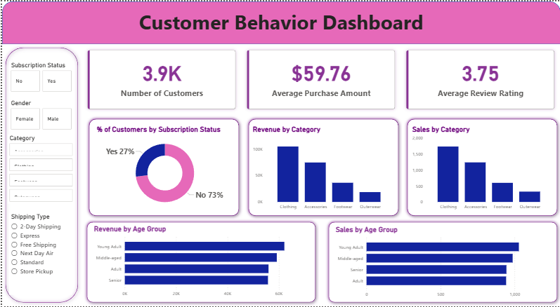

# Customer Behavior Analytics

A data analytics project focused on analyzing customer shopping behavior patterns using SQL and Python to derive actionable insights about purchasing trends, demographics, and customer segmentation.

## 📋 Project Overview

This project analyzes customer shopping data to understand:
- Revenue patterns across different customer demographics
- Impact of discounts and subscription status on purchase behavior
- Product performance and review ratings
- Customer segmentation based on purchase history
- Shipping preferences and their correlation with spending

## 🔧 Technologies Used

- **Python 3.x**
  - pandas - Data manipulation and analysis
- **SQL (PostgreSQL)** - Data querying and aggregation
- **Jupyter Notebook** - Interactive data exploration

## 🚀 Getting Started

### Prerequisites

```bash
pip install pandas numpy jupyter
```

### Running the Analysis

1. **Data Exploration (Jupyter Notebook)**
   ```bash
   jupyter notebook customer_behavior.ipynb
   ```

2. **SQL Analysis**
   - Import the CSV data into your SQL database
   - Execute queries from `customer_behavior_sql_queries.sql`

## � Dashboard



## �📈 Key Analyses

### SQL Queries Include:
- Revenue comparison by gender
- High-value customers with discount usage
- Top-rated products analysis
- Shipping type vs. purchase amount correlation
- Subscriber vs. non-subscriber spending patterns
- Product discount rate analysis
- Customer segmentation (New, Returning, Loyal)

### Python Analysis Features:
- Data cleaning and preprocessing
- Handling missing values (Review Rating imputation)
- Feature engineering (Age groups, Purchase frequency)
- Exploratory data analysis
- Statistical summaries


